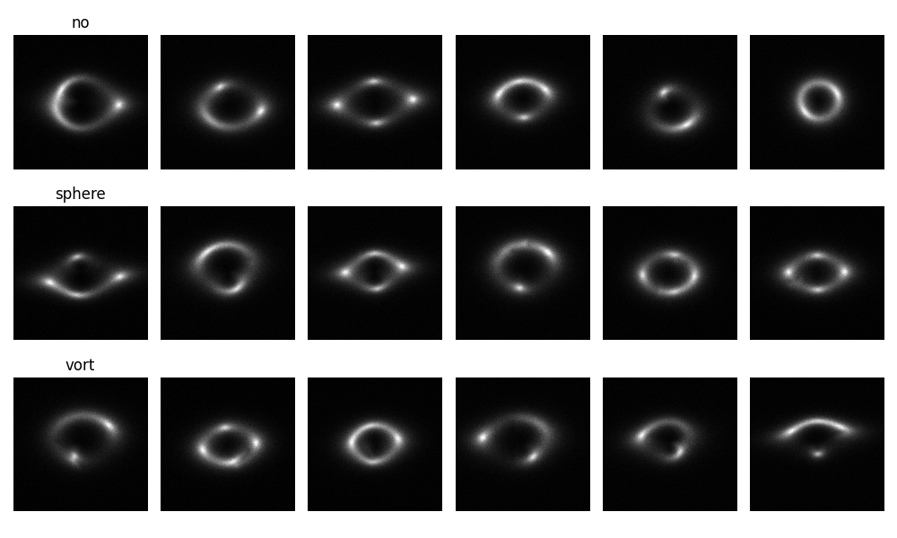
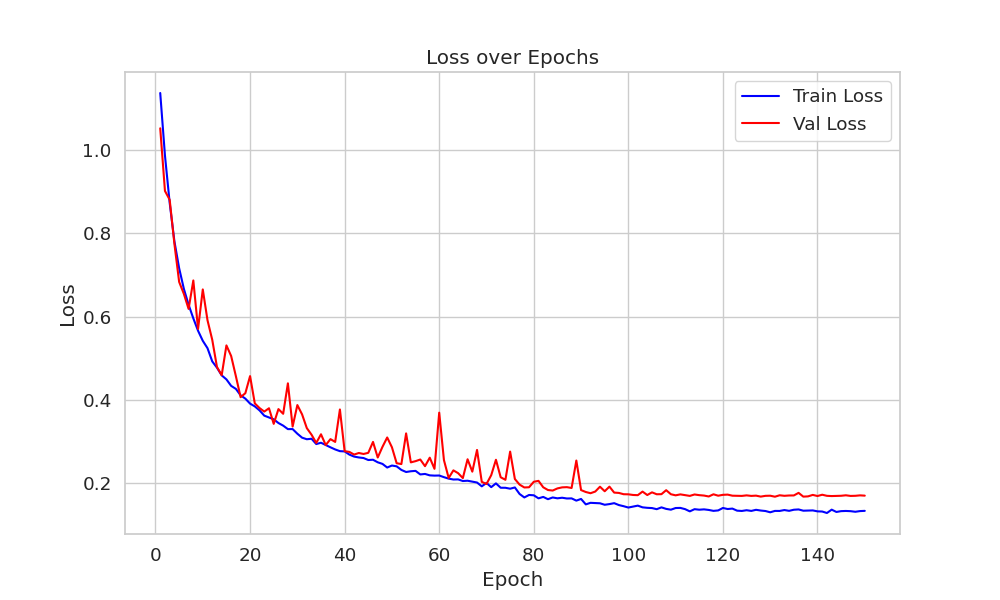
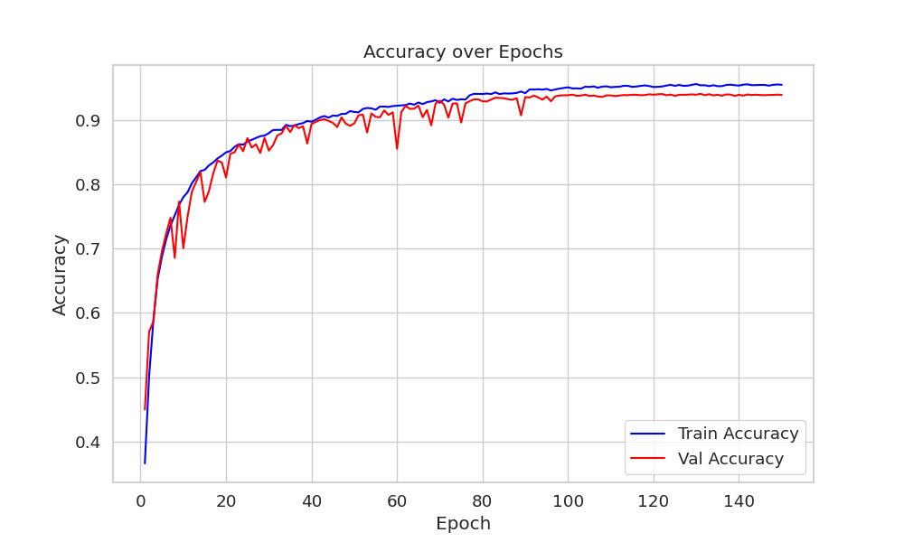
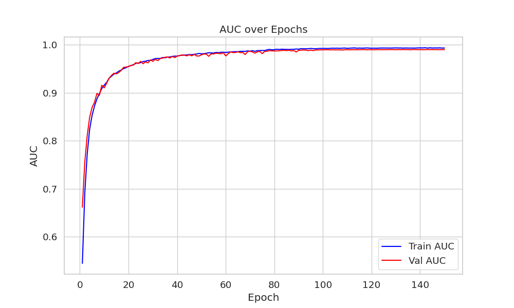

## Common Test I - Multi-Class Classification

This repository contains my solution to **Common Test I** of the DeepLense project for GSoC 2025. The task involves classifying images into three different lensing categories using **PyTorch**.

### 📌 Task Overview
The goal is to train a model that classifies images into one of three classes:
- **No substructure**
- **Subhalo substructure**
- **Vortex substructure**

The dataset was preprocessed using **min-max normalization**, and I explored data augmentation techniques to improve performance.

#### 📷 Sample Images from Each Class


### 📂 Folder Structure
```
common_test_01/
│── README.md  (This file)
│── common-test-i-multi-class-classification.ipynb  # Jupyter Notebook with implementation
│── best_vit_model.pth  # Best trained ViT model
│── assets/
│   ├── AUC.png  # ROC curve visualization
│   ├── Accuracies.png  # Accuracy trends over epochs
│   ├── losses.png  # Loss curves over epochs
│   ├── sampels.png  # Samples from each class
```

### 🛠 Model and Approach
I fine-tuned a **Vision Transformer (ViT-Tiny)** for this classification task. The training setup included:
- **Model Architecture:**
  - Pretrained **ViT-Tiny (patch16, 224)**
  - Fully connected layers: `1000 → 128 → 3`
  - Batch Normalization and Dropout (p=0.5) for regularization
- **Loss Function:** Cross-Entropy Loss
- **Optimizer:** Adam (lr = 1e-5, weight decay = 2e-4)
- **Learning Rate Scheduler:** ReduceLROnPlateau (factor=0.5, patience=5)
- **Batch Size:** 256
- **Number of Epochs:** 150
- **Augmentations Applied:**
  - CenterCrop (100) → Resize (224)
  - Random Horizontal & Vertical Flips (p=0.5)
  - Random Rotation (30°)
  - Normalization (mean=0.5, std=0.5)
  - As gravitational lensing images come from astronomical observations, and their color/brightness is physically meaningful, we didn't use ColorJitter, but we may give it a try to see it's impact on training. 

### 📊 Evaluation Metrics
- **ROC Curve (Receiver Operating Characteristic)**
- **AUC Score (Area Under the ROC Curve)**
- **Accuracy**

#### 📉 Training Metrics
- **Loss Curve**
  
- **Accuracy Over Epochs** (*93% on validation*)
  
- **AUC Curve** (*99% on validation*)
  