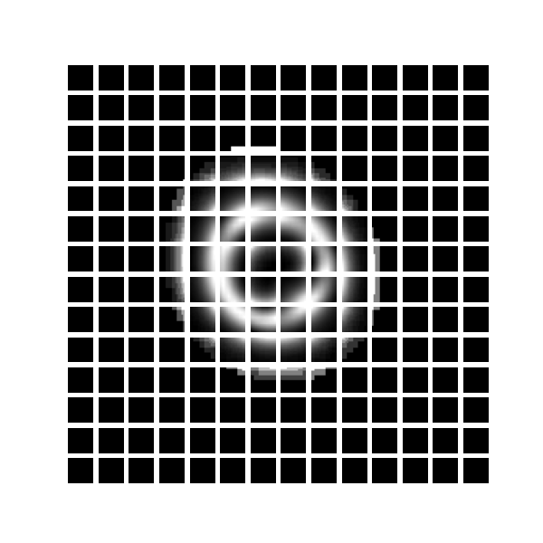
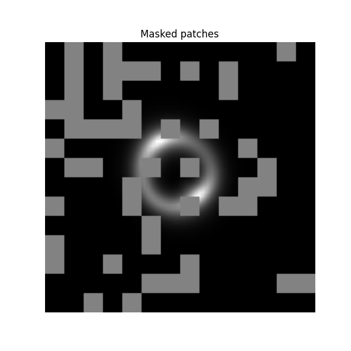
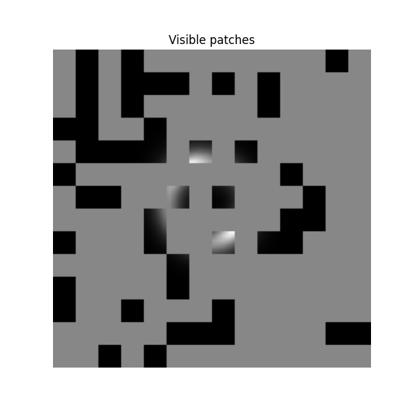

## **Specific Test VI - Foundation Model**  

This folder contains my solution for **Specific Test VI: Foundation Model** of the DeepLense GSoC 2025 project. The task involves pretraining a **Masked Autoencoder (MAE)** on strong lensing images and fine-tuning it for **multi-class classification** and **super-resolution** using **PyTorch**.  

### 📌 **Task Overview**  
The test consists of two main parts:  
1. **Pretraining a Masked Autoencoder (MAE)** on **no_sub** samples to learn meaningful feature representations.  
2. **Fine-tuning the MAE**:  
   - For **multi-class classification** (distinguishing between no_sub, cdm, and axion).  
   - For **super-resolution** (upscaling low-resolution images using high-resolution ground truths).  

#### 📷 Sample Images for Each Task
- **Samples for multi-class classification**
   
 
- **Samples for super-resolution**
   

### 📂 **Folder Structure**  
```
specific_test_06/
│── models/                        # 📂 Model definitions & weights
│   ├── mae.py                      # MAE model
│   ├── classifier.py                # Classification model
│   ├── super_resolution.py         # Super-Resolution model
│   ├── checkpoints/                 # Trained weights
│       ├── mae.pth
│       ├── classifier.pth
│       ├── super_resolution.pth
│
│── scripts/                        # 📂 Training & evaluation scripts NOTE the parameters here are hardcoded
│   ├── train_mae.py                 # Train MAE
│   ├── train_classifier.py          # Train classification model
│   ├── train_superresolution.py           # Train super-resolution model
│   ├── evaluate.py                  # Compute MSE, SSIM, PSNR, LPIPS # not created yet
│   ├── infer.py                     # Run inference on new images # not ready
│   ├── infer_01.py                  # Run inference on new images Classification # not ready
│
│── utils/                          # 📂 Helper functions
│   ├── Dataset.py                    # Data loading & augmentation
│   ├── metrics.py                    # SSIM, PSNR, LPIPS calculations
│   ├── helpful.py                    # helpful functions that's used alot
│   ├── vis.py                        # save plots like pca and tsne
│   ├── extract_encoderPart.py        # take parts from the trained mae model to be used for fine-tuning models
│
│── assets/                        # 📂 Store evaluation results
│   ├── mae/                                   # Images
│   ├── classification/                        # Images
│   ├── superresolution/                       # Images
│
│── notebooks/                      # 📂 Jupyter notebooks
│   ├── mae_training.ipynb                     # Training MAE step-by-step
│   ├── classification_training.ipynb          # Fine-tuning classifier
│   ├── super_resolution_training.ipynb        # Fine-tuning super-resolution
│
│── requirements.txt                 # 📜 Dependencies
│── README.md                         # 📜 Project overview
│── .gitignore                        # 🚫 Ignore large files (checkpoints, datasets)
```

### **Prepate Data for Masked Autoencoder (MAE) Pretraining**  

#### **Input for Encoder**
- **Sample for splitted-image**
   

- **Sample for masked-image**
   

|------------|-------------|
|  |  |
|------------|-------------|


### 🛠 **Model and Approach**  
#### **1️⃣ Masked Autoencoder (MAE) Pretraining**
- **Goal:** Learn a feature representation of strong lensing images.  
- **Architecture:** Vision Transformer (ViT) backbone with a reconstruction head.  
- **Pretraining Loss:** Mean Squared Error (MSE)
- **Optimizer:** AdamW 
- **Batch Size:** *256*
- **Epochs:** *250*

#### **2️⃣ Fine-Tuning for Multi-Class Classification**
- **Loss Function:** Cross-Entropy Loss  
- **Optimizer:** AdamW 
- **Batch Size:** *256*
- **Evaluation Metrics:** AUC Score, Accuracy  
- **Epochs:** *250*

#### **3️⃣ Fine-Tuning for Super-Resolution**
- **Loss Function:** Mean Squared Error (MSE)
- **Batch Size:** *256*
- **Evaluation Metrics:** MSE, SSIM, PSNR  
- **Epochs:** *200*

### 📊 **Results**
- I Will add all results and images from assets 

### 🚀 **Running the Code**  
1. Open any `*.ipynb` in Jupyter Notebook.  
2. Run all cells to train the models.  
3. Model checkpoints will be saved in `best_mae_model.pth`, `best_finetuned_model.pth`, and `best_superres_model.pth`.  

### 📬 **Submission Details**  
This task is part of my DeepLense GSoC 2025 submission.