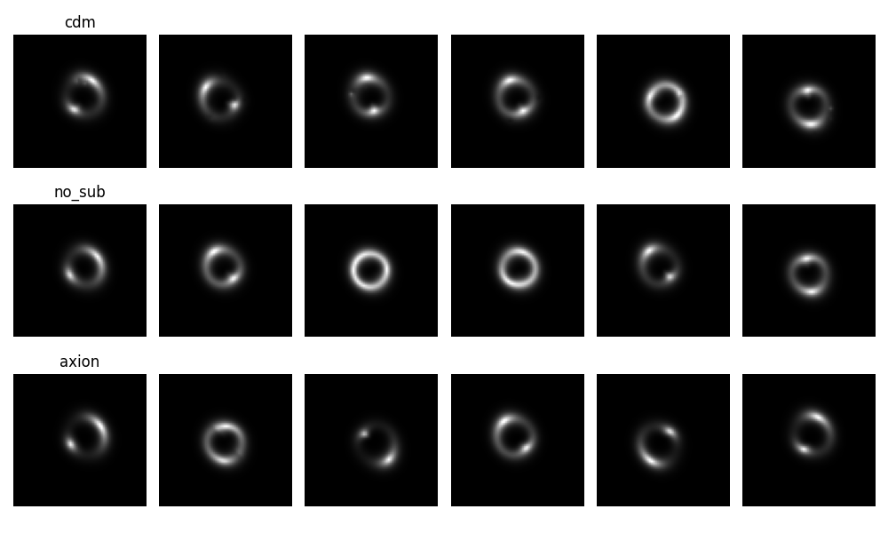
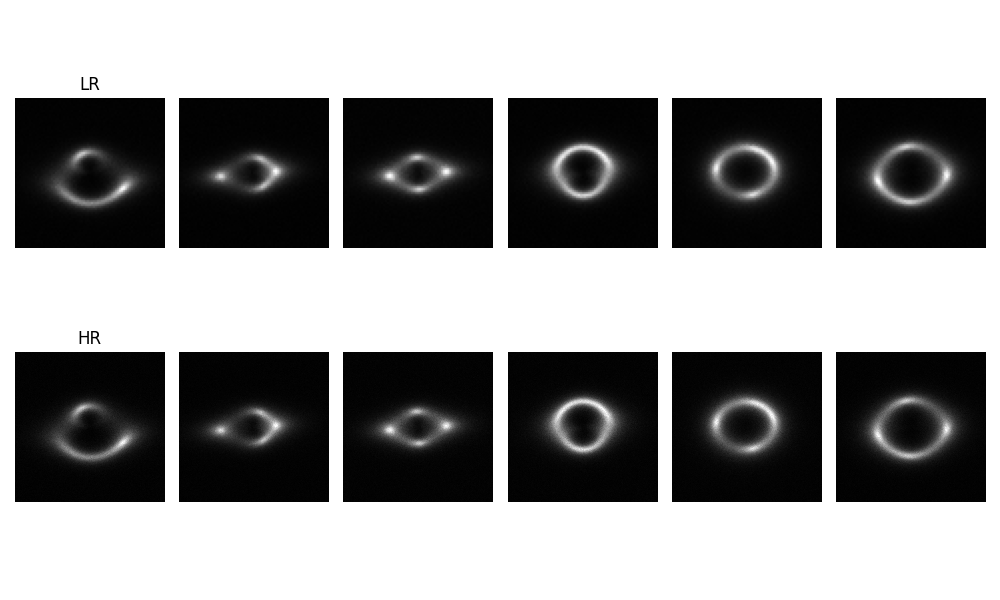
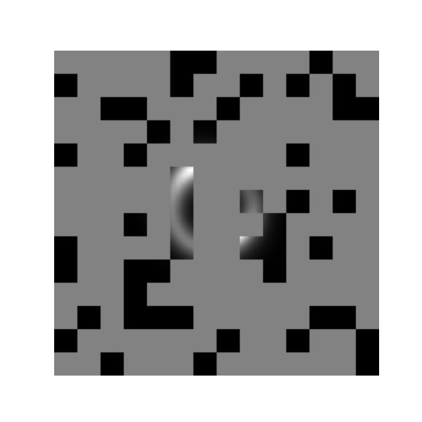

## **Specific Test VI - Foundation Model**  

This folder contains my solution for **Specific Test VI: Foundation Model** of the DeepLense GSoC 2025 project. The task involves pretraining a **Masked Autoencoder (MAE)** on strong lensing images and fine-tuning it for **multi-class classification** and **super-resolution** using **PyTorch**.  

### 📌 **Task Overview**  
The test consists of two main parts:  
1. **Pretraining a Masked Autoencoder (MAE)** on **no_sub** samples to learn meaningful feature representations.  
2. **Fine-tuning the MAE**:  
   - For **multi-class classification** (distinguishing between no_sub, cdm, and axion).  
   - For **super-resolution** (upscaling low-resolution images using high-resolution ground truths).  

#### 📷 Sample Images for Each Task
- **Samples for multi-class classification**
   

- **Samples for super-resolution**
   

### 📂 **Folder Structure**  
```
specific_test_06/
│── README.md  (This file)
│── foundation-model-mae.ipynb  # Jupyter Notebook with full implementation
│── best_mae_model.pth  # Pretrained MAE model weights
│── best_finetuned_model.pth  # Fine-tuned classification model weights
│── best_superres_model.pth  # Fine-tuned super-resolution model weights
│── assets/
│   ├── pretraining_loss.png  # Loss curve for MAE pretraining
│   ├── classification_roc.png  # ROC curve for classification
│   ├── superres_comparison.png  # Example outputs from super-resolution
```

### **Prepate Data for Masked Autoencoder (MAE) Pretraining**  

#### **Input for Encoder**
- **Sample for splitted-image**
   

- **Sample for masked-image**
   


### 🛠 **Model and Approach**  
#### **1️⃣ Masked Autoencoder (MAE) Pretraining**
- **Goal:** Learn a feature representation of strong lensing images.  
- **Architecture:** Vision Transformer (ViT) backbone with a reconstruction head.  
- **Pretraining Loss:** Mean Squared Error (MSE)  
- **Optimizer:** AdamW  
- **Batch Size:** *(To be added)*  
- **Epochs:** *(To be added)*  

#### **2️⃣ Fine-Tuning for Multi-Class Classification**
- **Loss Function:** Cross-Entropy Loss  
- **Optimizer:** AdamW  
- **Evaluation Metrics:** AUC Score, Accuracy  

#### **3️⃣ Fine-Tuning for Super-Resolution**
- **Loss Function:** Mean Squared Error (MSE) + Structural Similarity Index (SSIM)  
- **Evaluation Metrics:** MSE, SSIM, PSNR  


### 📊 **Results**  
- **MAE Pretraining Loss:** *(To be added)*  
- **Classification AUC Score:** *(To be added)*  
- **Super-Resolution SSIM/PSNR:** *(To be added)*  


### 🚀 **Running the Code**  
1. Open `foundation-model-mae.ipynb` in Jupyter Notebook.  
2. Run all cells to train the models.  
3. Model checkpoints will be saved in `best_mae_model.pth`, `best_finetuned_model.pth`, and `best_superres_model.pth`.  

### 📬 **Submission Details**  
This task is part of my DeepLense GSoC 2025 submission.